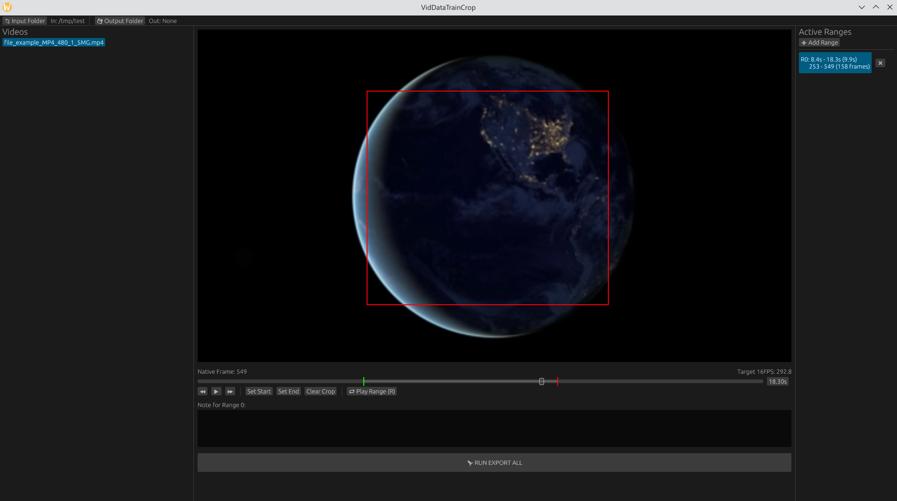

# VidDataTrainCrop 🎬

A lightweight, Rust-powered video utility designed for rapid data labeling, range cropping, and frame-accurate dataset preparation.
This tool allows you to load folders of videos, mark specific time ranges with custom notes, apply spatial crops, and export them as high-quality training samples.
Inspired by https://github.com/lovisdotio/VidTrainPrep in some way.



## ✨ Features

* **Folder-Based Workflow:** Quickly swap between multiple videos in a directory via the side navigation.
* **Frame-Accurate Navigation:** Step through videos frame-by-frame for precise boundary marking.
* **Range Management:** Create multiple labeled segments (ranges) per video.
* **Spatial Cropping:** Interactive click-and-drag cropping directly on the video preview.
* **Visual Feedback:** The timeline slider features color-coded markers (Green for Start, Red for End) to visualize your active segment.
* **Metadata Export:** Saves range-specific notes as `.txt` caption files alongside exported video clips.
* **FFmpeg Integration:**

---

## ⌨️ Keyboard Shortcuts

| Key | Action |
| --- | --- |
| **Space** | Play / Pause video |
| **I** | Set **In-point** (Start Time) for the current range |
| **O** | Set **Out-point** (End Time) for the current range |
| **R** | **Preview Range**: Jumps to Start and plays until End |
| **←** | Step backward 1 frame |
| **→** | Step forward 1 frame |

---

## 🚀 Getting Started

### Prerequisites

* **Rust:** [Install Rust](https://rustup.rs/)
* **OpenCV:** Ensure OpenCV 4.x is installed on your system.
* **FFmpeg:** Must be available in your system `PATH` for the export functionality to work.

### Installation

1. Clone the repository:
```bash
git clone https://github.com/your-username/VidDataTrainCrop.git
cd VidDataTrainCrop

```

2. Build:
```bash
cargo build --release
```

## 🛠 Usage

1. **Select Folders:** Use the top bar to pick your **Input Folder** (where your source videos are) and your **Output Folder** (where the crops will go).
2. **Navigate:** Select a video from the left panel. Use the arrow keys or slider to find the start of your segment.
3. **Mark & Crop:** Press `I` for start, `O` for end (or use the buttons). Drag your mouse over the video to define the freeform crop area.
4. **Note:** Add any descriptions or labels in the text box provided.
5. **Export:** Click **RUN EXPORT ALL**. The app will process each range as a separate `.mp4` and `.txt` file using a background thread so the UI remains responsive.
